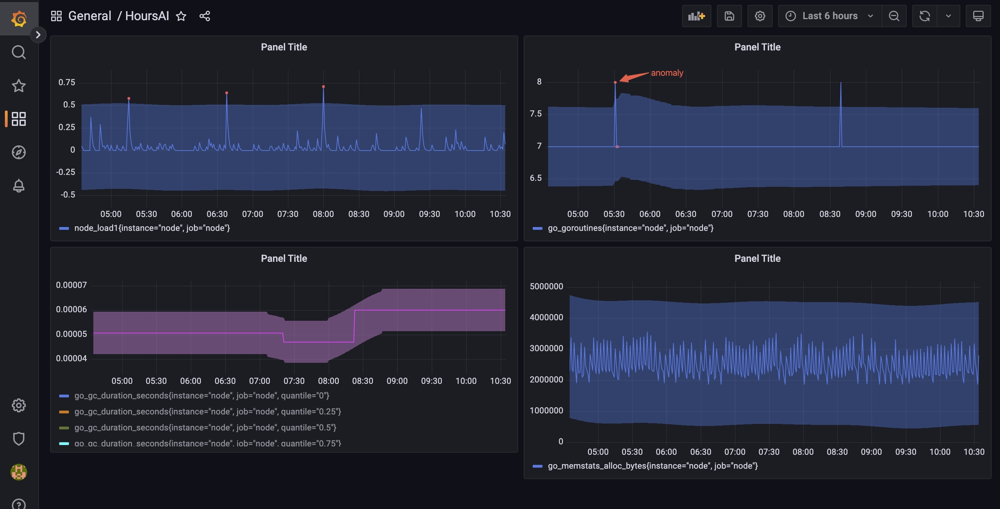
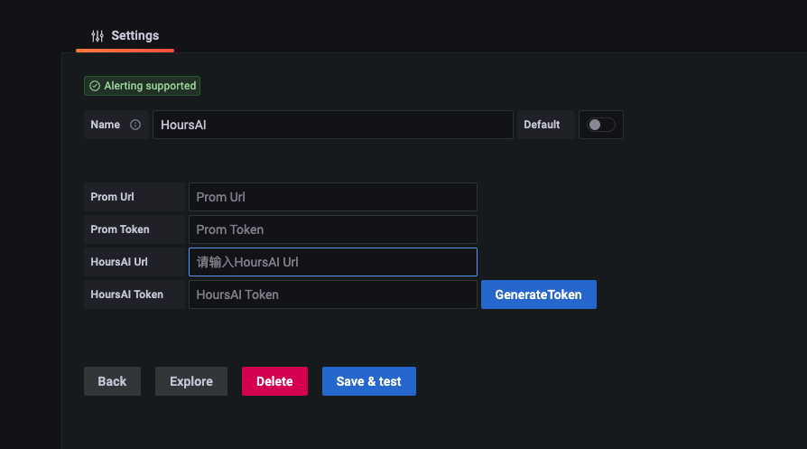
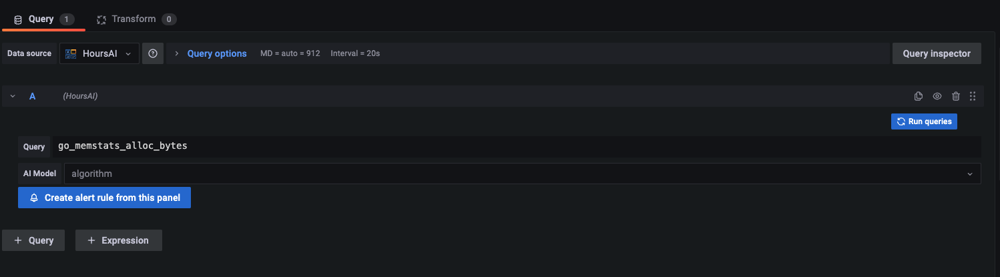

### HoursAI Grafana Datasource Plugin

With its advanced AI capabilities, HoursAI provides unified AI services that help users analyze their 
observability data, including logs, metrics, and traces. These types of data can be easily visualized on 
various platforms such as Grafana without any additional effort.

### Set up

To install the plugin simply clone this repository to your Grafana's plugins directory. 
It's located at {grafana}/data/plugins.

### Create a datasource

1. Click on the "Add data source" button
2. Select "HoursAI" from the list
3. Fill in the required fields other than the HoursAI URL. HoursAI is a cloud service with the address:
http://hoursai.cloudwise.sg/
4. Click on the "GenerateToken" button
5. Click on the "Save & Test" button

### Create a panel

1. Input the query in the query field
2. Select the AI Model from Model List
3. Click on the "Run Query" button
